```mermaid
erDiagram
  accounts {
    uuid id PK
    text name
    text email
    text photo_url
    int points_balance
    text role
    timestamptz notifications_muted_until
  }
  sessions {
    uuid id PK
    uuid account_id FK
    text token
    uuid impersonating_account_id FK
    timestamptz expires_at
  }
  points_ledger {
    uuid id PK
    uuid account_id FK
    int delta
    text reason
  }
  notifications {
    uuid id PK
    uuid account_id FK
    text type
    text title
    text body
    text link_url
    timestamptz read_at
  }
  apns_tokens {
    uuid id PK
    uuid account_id FK
    text token
  }
  push_subscriptions {
    uuid id PK
    uuid account_id FK
    text endpoint
    text auth
  }
  scheduled_push_notifications {
    uuid id PK
    uuid account_id FK
    text title
    text body
    timestamptz scheduled_for
    timestamptz sent_at
  }
  settings {
    text key PK
    text value
  }

  products {
    uuid id PK
    text sku
    text name
    int price_points
    bool is_active
  }
  product_media {
    uuid id PK
    uuid product_id FK
    text media_type
    text url
    int sort_order
  }
  inventory {
    uuid product_id PK
    int stock_qty
    int lead_time_days
  }
  baskets {
    uuid id PK
    uuid account_id FK
    uuid discount_code_id FK
    uuid delivery_option_id FK
  }
  basket_items {
    uuid id PK
    uuid basket_id FK
    uuid product_id FK
    int qty
  }
  orders {
    uuid id PK
    uuid account_id FK
    uuid discount_code_id FK
    uuid delivery_option_id FK
    text status
    int total_points
  }
  order_items {
    uuid id PK
    uuid order_id FK
    uuid product_id FK
    text product_name
    int qty
    int line_total_points
  }
  order_status_history {
    uuid id PK
    uuid order_id FK
    text status
    text reason
  }
  discount_codes {
    uuid id PK
    text code
    text discount_type
    int discount_value
    int max_uses
    bool is_active
  }
  delivery_options {
    uuid id PK
    text name
    int points
    bool is_active
  }
  hero_slides {
    uuid id PK
    text image_url
    text title
    text code
    int sort_order
  }
  product_reviews {
    uuid id PK
    uuid product_id FK
    uuid account_id FK
    text body
  }
  review_likes {
    uuid id PK
    uuid review_id FK
    uuid account_id FK
  }
  game_rewards {
    uuid id PK
    uuid account_id FK
    uuid product_id FK
    text source_type
    uuid source_id
    uuid order_id FK
    text status
  }

  chat_messages {
    uuid id PK
    uuid sender_id FK
    uuid recipient_id FK
    text body
    uuid reply_to_message_id FK
    uuid reply_to_story_id FK
    jsonb slider_response
    timestamptz read_at
  }
  chat_poll_votes {
    uuid message_id FK
    uuid account_id FK
    int option_idx
  }
  scrolls {
    uuid id PK
    uuid sender_id FK
    uuid recipient_id FK
    text body
    text origin_label
    text dest_label
    text from_label
    int flight_seconds
    timestamptz deliver_at
    bool delivered
    int la_phase
    jsonb route_streets
    text la_channel_id
  }
  scrolls_settings {
    bool id PK
    int crow_speed_kmh
    numeric speed_multiplier
    int max_chars
    text scroll_font
  }
  scrolls_frames {
    text layer PK
    int frame_order PK
    text sprite_file
  }
  live_activity_tokens {
    uuid id PK
    uuid account_id FK
    uuid scroll_id FK
    text kind
    text token
  }
  forecast_settings {
    int id PK
    bool enabled
    intarray send_days
    jsonb send_times
    text recipient
    text location_label
    text last_sent_slot
  }

  sneaky_stories {
    uuid id PK
    uuid author_id FK
    text media_url
    text media_type
    text caption
    jsonb stickers
    timestamptz expires_at
  }
  story_reels {
    uuid id PK
    text name
    uuid cover_story_id FK
    uuid created_by FK
  }
  reel_stories {
    uuid reel_id FK
    uuid story_id FK
  }
  story_views {
    uuid story_id FK
    uuid viewer_id FK
    timestamptz viewed_at
  }
  moments {
    uuid id PK
    uuid account_id FK
    text type
    text location
    text body
    textarray tags
  }
  moment_media {
    uuid id PK
    uuid moment_id FK
    text type
    text url
  }
  timeline_milestones {
    uuid id PK
    date date
    text title
    text description
    jsonb media
    numeric location_lat
    numeric location_lng
  }

  tic_tac_face_matches {
    uuid id PK
    int total_rounds
    int rounds_played
    uuid winner_account_id FK
  }
  tic_tac_face_games {
    uuid id PK
    uuid match_id FK
    jsonb board
    uuid turn_account_id FK
    uuid winner_account_id FK
  }
  giftsweeper_matches {
    uuid id PK
    uuid initiator_account_id FK
    uuid opponent_account_id FK
    uuid current_turn_account_id FK
    int cost_per_cell
  }
  giftsweeper_items {
    uuid id PK
    uuid match_id FK
    uuid owner_account_id FK
    uuid product_id FK
    jsonb cells
  }
  giftsweeper_guesses {
    uuid id PK
    uuid match_id FK
    uuid guesser_account_id FK
    uuid hit_item_id FK
    int cell_row
    int cell_col
  }
  wheels {
    uuid id PK
    text name
    bool is_active
  }
  wheel_segments {
    uuid id PK
    uuid wheel_id FK
    uuid product_id FK
    text label
    text award_type
    int points_delta
  }
  wheel_spins {
    uuid id PK
    uuid wheel_id FK
    uuid account_id FK
    uuid segment_id FK
    text award_summary
  }
  shut_the_box_games {
    uuid id PK
    uuid account_id FK
    int result
    int final_tiles_open
  }
  dice_trophies {
    uuid id PK
    uuid account_id FK
    uuid game_id FK
  }
  stb {
    uuid id PK
    uuid account_id FK
    int result
    int final_tiles_open
  }
  ducky_races {
    uuid id PK
    uuid account_id FK
    jsonb lineup
    int winner_ord
    int stake
    int payout
    bool won
  }
  dirty_wordle_results {
    uuid id PK
    uuid account_id FK
    date date
    bool won
    int guesses_taken
    jsonb guess_grid
  }
  dirty_wordle_schedule {
    date date PK
    text word
    int cycle
  }
  dirty_wordle_word_bank {
    text word PK
    date used_on
  }
  dirty_wordle_series {
    int id PK
    text name
    date starts_on
    date ends_on
  }
  jstw_config {
    int id PK
    bool enabled
    int min_len
    int max_len
    int words_per_day
    int score_floor
    int countdown_seconds
  }
  jstw_word_bank {
    text word PK
    jsonb syllables
    int length
    int syllable_count
    date used_on
  }
  jstw_schedule {
    date date PK
    int word_index PK
    text word
    jsonb syllables
  }
  jstw_results {
    uuid account_id FK
    date date PK
    int word_index PK
    text word
    int score
    int points
  }
  jstw_series {
    int id PK
    text name
    date starts_on
    date ends_on
  }
  truth_or_dare_prompts {
    uuid id PK
    text type
    text text
  }
  entertainment_titles {
    uuid id PK
    text label
    bool active
  }
  sneaky_button_config {
    int id PK
    bool homepage_visible
    intarray homepage_days
    text animal_type
  }
  sneakyscapes_garden {
    uuid id PK
    jsonb placements
    uuid updated_by FK
  }
  spreadsheet_tabs {
    uuid id PK
    text name
    int position
    jsonb columns
    jsonb data
  }

  rewatch_items {
    uuid id PK
    uuid account_id FK
    text tmdb_id
    text title
    int watch_month
    int watch_year
    bool watched
  }
  rewatch_invites {
    uuid id PK
    uuid from_account_id FK
    uuid to_account_id FK
    text tmdb_id
    text status
  }
  playlist_items {
    uuid id PK
    uuid account_id FK
    text igdb_id
    text title
    bool played
  }
  playlist_invites {
    uuid id PK
    uuid from_account_id FK
    uuid to_account_id FK
    text igdb_id
    text status
  }
  reads_items {
    uuid id PK
    uuid account_id FK
    uuid suggested_by FK
    text title
    text author
    bool read
  }
  notes {
    uuid id PK
    uuid account_id FK
    text body
  }
  audio_notes {
    uuid id PK
    text name
    text audio_url
  }
  calendar_events {
    uuid id PK
    uuid created_by FK
    text title
    timestamptz starts_at
    timestamptz ends_at
    bool all_day
  }
  shopping_trips {
    uuid id PK
    uuid event_id FK
    text name
  }
  shopping_items {
    uuid id PK
    uuid trip_id FK
    uuid added_by FK
    text name
    int qty
    bool checked
  }
  shopping_history {
    text name_key PK
    text name
    int times_used
  }
  groceries {
    uuid id PK
    text name
    text barcode
  }

  surveys {
    uuid id PK
    text title
    bool is_active
  }
  survey_questions {
    uuid id PK
    uuid survey_id FK
    text question_text
    text question_type
    jsonb options
  }
  survey_responses {
    uuid id PK
    uuid survey_id FK
    uuid account_id FK
  }
  survey_answers {
    uuid id PK
    uuid response_id FK
    uuid question_id FK
    text value
  }

  accounts ||--o{ sessions : "has"
  accounts ||--o{ points_ledger : "earns"
  accounts ||--o{ notifications : "receives"
  accounts ||--o{ apns_tokens : "registers"
  accounts ||--o{ push_subscriptions : "registers"
  accounts ||--o{ scheduled_push_notifications : "targets"
  accounts ||--o{ baskets : "owns"
  accounts ||--o{ orders : "places"
  accounts ||--o{ product_reviews : "writes"
  accounts ||--o{ review_likes : "likes"
  accounts ||--o{ game_rewards : "wins"
  accounts ||--o{ chat_messages : "sends-receives"
  accounts ||--o{ chat_poll_votes : "votes"
  accounts ||--o{ scrolls : "sends-receives"
  accounts ||--o{ live_activity_tokens : "owns"
  accounts ||--o{ sneaky_stories : "authors"
  accounts ||--o{ story_reels : "creates"
  accounts ||--o{ story_views : "views"
  accounts ||--o{ moments : "logs"
  accounts ||--o{ notes : "writes"
  accounts ||--o{ calendar_events : "creates"
  accounts ||--o{ sneakyscapes_garden : "edits"
  accounts ||--o{ wheel_spins : "spins"
  accounts ||--o{ shut_the_box_games : "plays"
  accounts ||--o{ stb : "plays"
  accounts ||--o{ dice_trophies : "wins"
  accounts ||--o{ ducky_races : "plays"
  accounts ||--o{ dirty_wordle_results : "plays"
  accounts ||--o{ jstw_results : "plays"
  accounts ||--o{ rewatch_items : "adds"
  accounts ||--o{ playlist_items : "adds"
  accounts ||--o{ reads_items : "adds"
  accounts ||--o{ shopping_items : "adds"
  accounts ||--o{ survey_responses : "submits"
  accounts ||--o{ tic_tac_face_games : "plays"
  accounts ||--o{ giftsweeper_matches : "plays"

  products ||--|| inventory : "stock"
  products ||--o{ product_media : "has"
  products ||--o{ basket_items : "in"
  products ||--o{ order_items : "in"
  products ||--o{ product_reviews : "reviewed by"
  products ||--o{ wheel_segments : "awarded via"
  products ||--o{ giftsweeper_items : "hidden as"
  products ||--o{ game_rewards : "granted as"

  baskets ||--o{ basket_items : "contains"
  baskets }o--|| discount_codes : "applies"
  baskets }o--|| delivery_options : "uses"
  orders ||--o{ order_items : "contains"
  orders ||--o{ order_status_history : "tracks"
  orders }o--|| discount_codes : "applies"
  orders }o--|| delivery_options : "uses"
  orders ||--o{ game_rewards : "fulfils"
  product_reviews ||--o{ review_likes : "liked via"

  chat_messages ||--o{ chat_poll_votes : "poll on"
  chat_messages ||--o{ chat_messages : "reply to"
  sneaky_stories ||--o{ chat_messages : "reply to story"
  scrolls ||--o{ live_activity_tokens : "drives"

  sneaky_stories ||--o{ story_views : "seen via"
  sneaky_stories ||--o{ reel_stories : "in reel"
  story_reels ||--o{ reel_stories : "groups"
  story_reels }o--|| sneaky_stories : "cover"
  moments ||--o{ moment_media : "has"

  wheels ||--o{ wheel_segments : "has"
  wheels ||--o{ wheel_spins : "spun on"
  wheel_segments ||--o{ wheel_spins : "landed on"

  tic_tac_face_matches ||--o{ tic_tac_face_games : "rounds"
  giftsweeper_matches ||--o{ giftsweeper_items : "hides"
  giftsweeper_matches ||--o{ giftsweeper_guesses : "guesses"
  giftsweeper_items ||--o{ giftsweeper_guesses : "hit by"
  shut_the_box_games ||--o{ dice_trophies : "yields"

  calendar_events ||--o{ shopping_trips : "linked to"
  shopping_trips ||--o{ shopping_items : "lists"

  surveys ||--o{ survey_questions : "asks"
  surveys ||--o{ survey_responses : "collects"
  survey_responses ||--o{ survey_answers : "gives"
  survey_questions ||--o{ survey_answers : "answered by"
```

## Notes on the model

- **`accounts` is the hub** — a two-person app, so almost every entity hangs off it (sender/recipient, author, owner). Relationships to `accounts` that appear twice (e.g. `chat_messages`, `scrolls`, `tic_tac_face_*`) are distinct FKs (sender vs recipient, the two players, etc.).
- **Points economy**: `points_ledger` is the append-only source of truth for balance changes; `accounts.points_balance` is the running cache. Game results (`dirty_wordle_results`, `jstw_results`, `ducky_races`, `wheel_spins`, orders) all credit/debit via the ledger.
- **Scrolls / Live Activity**: `scrolls` carries the flight + narration state (`la_phase`, `route_streets`); `la_channel_id` is the APNs broadcast channel; `live_activity_tokens` holds the device push-to-start / update tokens (the fallback path).
- **Polymorphic edges** (not real FKs, so not drawn): `game_rewards.source_type/source_id` points at whichever game produced the reward; `notifications.link_url` is a free-text deep link.
- **Config / content singletons** (one-row or lookup tables, no relationships): `scrolls_settings`, `stb_config` & palettes, `ducky_*` content lists, `sneaky_button_config`, `entertainment_titles`, `hero_slides`, `audio_notes`, `groceries`, `shopping_history`, `dirty_wordle_word_bank`, `jstw_word_bank`, `dirty_wordle_schedule`/`series`, `jstw_schedule`/`series`. Included as entities but they float free of the graph.
- **Two "Shut the Box" eras** exist in the schema (`shut_the_box_games`/`dice_trophies`/`stb_config` and the newer `stb`/`stb_*` tables) — both shown.
